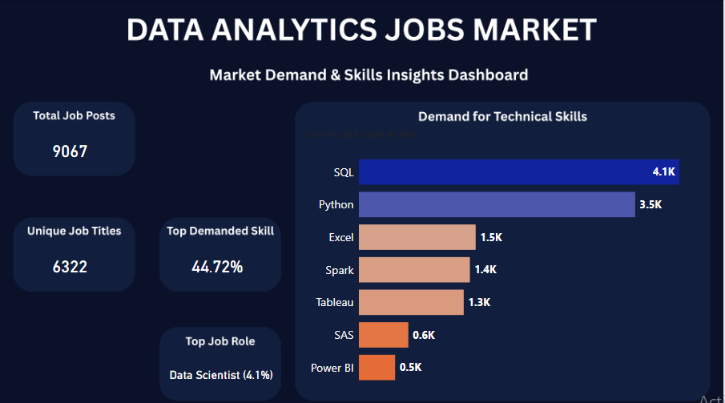

# 📊 Data Analytics Job Market - End-to-End Analytics Project

An interactive, corporate-grade dashboard project that investigates market demands, skill requirements, and role distributions in the Data Analytics field. This project showcases a full data pipeline: **Exploration & Cleaning in Jupyter Notebook**, **UI/UX Blueprint Design in Canva**, and **Production-Ready Dashboard Deployment in Power BI**.

---

## 🗺️ Project Architecture & Pipeline

---

## 🛠️ Step 1: Data Auditing & Preparation (Jupyter Notebook)

The original dataset contained **9,067 records** of analytics job openings. The pipeline executed in Python focused on maximizing data hygiene and targeting technical keywords hidden inside long strings.

### 🔍 Data Hygiene & Preprocessing
* **Null Check:** Verified zero missing values (`df.isnull().sum()`) across the dataset.
* **Duplication Audit:** Confirmed zero absolute duplicate entries (`df.duplicated().sum()`).
* **Dimensional Optimization:** Dropped the redundant row-index tracker column (`Unnamed: 0`) using `df.drop()` to speed up analytical engines.
* **Data Ingestion Export:** Saved the final clean baseline as `Job_Posts_Cleaned.csv`.

### 🧮 Granular Feature Engineering & Regex Mining
Standard textual tokenization yielded conversational text constraints (Stop Words). To circumvent this, targeted Case-Insensitive Regular Expressions (`\bkeyword\b`) were developed to sift through `Job_Description` columns and pull absolute counts for core platform tech-stacks:
```python
# Programmatic isolation of critical market skills
skills = ['sql', 'python', 'excel', 'tableau', 'power bi', 'sas', 'spark']
for skill in skills:
    skill_counts[skill] = df['Job_Description'].str.contains(rf'\b{skill}\b', case=False, regex=True).sum()
```

---

## 🎨 Step 2: UI/UX Canvas Customization (Canva Blueprint)

To bypass the rigid look of standard software tools, a custom UI asset layout was constructed at a standardized presentation scale of **1920x1080 px** (16:9 Aspect Ratio).

* **Color Theory:** Built using a modern dark tech theme—deep navy primary canvas (`#0A1128`) layered with modern structural container boxes (`#121E3D`) to isolate distinct analytic cards.
* **Layout Segmentation:** Structured with 4 distinct floating left-hand placeholders for core KPIs, leaving a massive right-hand container block explicitly mapped to host the primary dynamic visual.

---

## 📈 Step 3: Business Intelligence Engineering (Power BI)

The optimized data extract and custom canvas were imported into Power BI Desktop to build the production interface.

### 📊 Case Sensitivity & Data Consolidation
During volume computation, Power BI inherently treats string combinations like `Data Analyst` and `data analyst` uniformly. This eliminated fragmentation, refining the total unique role taxonomy down from Jupyter's **6,385** variations to a realistic **6,322 distinct market roles**.

### 🧪 Advanced DAX Metrics & Layout Layering
Calculated calculated columns and high-performance aggregate measures to supply values directly to the transparent interface layers:

```dax
// 1. Core Volume Tracker
Total Job Posts = COUNTROWS('Job_Posts_Cleaned')

// 2. Marketplace Role Heterogeneity
Unique Job Titles = DISTINCTCOUNT('Job_Posts_Cleaned'[Job_Title])

// 3. Foundation Market Demand Focus
SQL Demand Pct = 
VAR TotalJobs = COUNTROWS('Job_Posts_Cleaned')
VAR SQLCount = 4055
RETURN DIVIDE(SQLCount, TotalJobs)

// 4. Standardized Dynamic Target Role Callout
Data Scientist Pct = 
VAR TotalJobs = COUNTROWS('Job_Posts_Cleaned')
VAR DSCount = 372
VAR Percentage = DIVIDE(DSCount, TotalJobs)
RETURN "Data Scientist (" & FORMAT(Percentage, "0.0%") & ")"
```

### 📉 Visual Optimization & Analytics Charting
* **Dynamic Analytics:** Inserted a customized horizontal clustered bar chart driven by a static manual data table mapping out Python-engineered frequency results.
* **Color Synchronization:** Configured a conditional grading algorithm utilizing the `Sum of Jobs Count` field to assign smooth continuous color scaling (Gradient Mapping) across bars—replicating the precise thematic flow used in Jupyter.
* **Data Clarity:** Suppressed redundant Axis Titles and Legends, enabling direct-read **Data Labels** on top of bars to optimize scannability.

---

## 📌 Executive Dashboard Preview

Here is the final single-page dark mode interactive dashboard:



